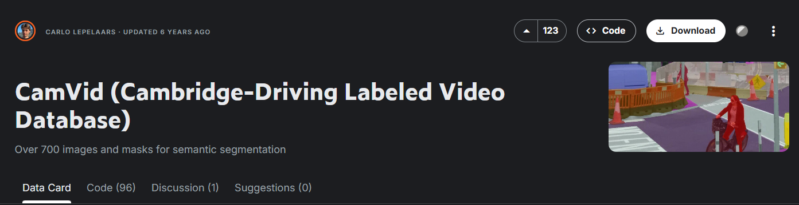

# Chapter 2: <br>Deep Learning Classification, CNNs, Segmentation, Object Detection

In this chapter, we move on to deep learning for computer vision. We cover image classification, CNN architectures, semantic segmentation, and object detection.
>**Note:**<br>
>This section of the repository is divided into two parts:
>
>- Theoretical
>- Practical
## ✒️ Theoretical part
In this section, we review and strengthen our theoretical understanding of:
- Batch Normalization: how it works, computational cost benefits and others...
- Dilated Convolution: its complete workflow and formulation
- ROI Alignment: concept and meaning in action
- Convolution Gradient: how the gradient flows through the network
- Vanishing gradient: the main problem in the **really deep** Neural Networks
- MobileNet: it's usecase and upgraded variants of it

## 👨🏾‍💻 Practical Part<br>
Before starting the practical exercises, it is worth mentioning that all trained models and generated DataFrames are stored in the `Results/Models` and `Results/Dataframes` directories so that you can compare your own results with mine.

*  **1-Classification:** in the first part, we will test the reall world datasets
 `cifar 10` and `cifar 100` for classification purposes, and how the architecture
  of a model really affects the Models accuracy.
   <p align="center">
      
      <br>
      <em>Figure 1: cifar 10 dataset</em>
    </p>
    <p align="center">
      
      <br>
      <em>Figure 2: cifar 100 dataset</em>
    </p>

* **2-Segmentation**  In this section, I used the [`CamVid`](https://www.kaggle.com/datasets/carlolepelaars/camvid) dataset from Kaggle,
  since the dataset referenced by the authors was originally hosted on Google Drive and is no longer available.  
  CamVid is one of the closest alternatives to the dataset used in the original project, and its full description can be found at the link above.

  <p align="center">
    
    <br>
    <em>Figure 3: CamVid dataset</em>
  </p>

* **3-Object Detection End-to-End License Plate Recognition** 

  In this section, we focus on the **Object Detection** stage of the project and build a complete **License Plate Recognition (LPR)** pipeline.

  Fortunately, the [dataset](https://drive.google.com/drive/folders/1StRhbI28MaoiuXqA2rG5vGqKG5K2bMW6?usp=shari). required for this assignment is still publicly accessible through the course resources provided by the instructor.

  ---

  ## Dataset Overview

  After downloading the dataset, you will obtain **two ZIP files**:

  - **IR-LPD**
  - **IR-LPR**

  Each dataset serves a different purpose throughout the project.

  ---

  ## 1. IR-LPD Dataset (License Plate Detection)

  The **IR-LPD** dataset is used to train and evaluate the **YOLO11n** object detection model for locating license plates in vehicle images.

  However, after extracting the dataset, all images and annotation files are placed into only two folders:

  - Images
  - Labels

  Since YOLO requires a specific directory structure (with separate **Train** and **Validation** sets defined in a YAML configuration file), the dataset cannot be used directly.

  Therefore, in the first few notebook cells, the dataset is:

  - randomly shuffled,
  - split into **Training** and **Validation** subsets,
  - reorganized into the directory structure expected by YOLO.

  For convenience, the complete folder hierarchy used throughout this assignment is also provided.

    <p align="center">
    
    <br>
    <em>Figure 4: An example of YOLO prediction with 73% confidence</em>
  </p>

  ---

  ## 2. IR-LPR Dataset (Optical Character Recognition)

  The **IR-LPR** dataset is used to train the OCR model responsible for recognizing the characters on detected license plates.

  A custom CNN architecture is trained to classify every possible character that may appear on Iranian license plates.

  Throughout this section, several validation and sanity-check steps are included to verify intermediate outputs and reduce the chance of incorrect predictions caused by preprocessing or model inference.

  ---

  ## 3. End-to-End License Plate Recognition Pipeline

  In the final part of this notebook, both trained models are combined into a complete end-to-end recognition pipeline.

  The pipeline performs the following steps:

  1. Load validation images from the **IR-LPD** dataset.
  2. Detect license plates using the trained **YOLO11n** model.
  3. Crop the detected license plate regions.
  4. Apply the trained OCR model to recognize the license plate characters.
  5. Compare the predictions with the provided ground-truth annotations.
  6. Evaluate the overall performance using:
    - **Exact Match Accuracy**
    - **Character Error Rate (CER)**

  These pretrained weights allow the notebook to reproduce the complete inference pipeline without retraining the models from scratch.

  <p align="center">
  
    <br>
    <em>Figure 5: an example of YOLO prediction of the validation set/ input to the OCR</em>
  </p>

## 📂 Contents
The `Results` directory contains the following files:

* `Models`:
  * `best.pt`: Best-performing YOLO11n weights obtained during training
  * `last.pt`: Final YOLO11n weights from the last training epoch
  * `PLPR-CNN.pth`: Best-performing OCR model trained on the IR-LPR dataset
  * `cifar10_Q1_checkpoint.pth`: final model after the trining on the cifar 10 dataset with 
  approximately 90% accuracy on the test set
  * `cifar100_Q1_checkpoint.pth`: The same pretrained feature extractor with only the final classification 
  layer retrained on CIFAR-100 dataset with approximately 40% accuracy on the test set.
  * `CamVid_unet_Q2_checkpoint.pth`: the final U-Net checkpoint trained for the `Segmentation` notebook.
  * `CamVid_unet_Q2_checkpoint.pth`: the final U-Net checkpoint trained for the `Segmentation` notebook.
* `Dataframes`:
  * `cifar10_Q1_Classification_test_df.xlsx`& `cifar10_Q1_Classification_train_df.xlsx`
   &  `cifar10_Q1_Classification_valid_df.xlsx` the results of training and evaluation model on 
   the `cifar 10` dataset saved for visualizing purposes
  * `cifar100_Q1_Classification_test_df.xlsx`& `cifar100_Q1_Classification_train_df.xlsx`
   &  `cifar100_Q1_Classification_valid_df.xlsx` the results of training and evaluation model on 
   the `cifar 100` dataset saved for visualizing purposes

## 🌳 Project Directory Structure

The following directory structure is used throughout this notebook.

```text
2 - HW2/
├── Practical/
│   ├── data/
│   │   ├── camvid/
│   │   ├── cifar-10-batches-py/
│   │   ├── cifar-100-python/
│   │   ├── IR-LPD/
│   │   └── IR-LPR/
│   │
│   ├── Results/
│   │   ├── DataFrames/
│   │   ├── Models/
│   │   └── validation_plate_crops/
│   │
│   └── runs/
│       └── detect/
│           ├── train/
│           └── train-2/
│               └── weights/
│
└── Theoretical/
```

**Directory description**

| Directory | Description |
|-----------|-------------|
| `IR-LPD` | License plate detection dataset used for YOLO training |
| `IR-LPR` | Character recognition dataset used to train the OCR model |
| `Results/Models` | Saved YOLO and OCR model weights |
| `Results/DataFrames` | Generated prediction and evaluation DataFrames |
| `validation_plate_crops` | Cropped license plate images produced during inference |
| `runs/detect` | YOLO training logs and checkpoints |
```
## 🛠 Prerequisites

Install the required packages before running the notebooks:

```bash
pip install imageio, kagglehub, ipywidgets, ultralytics, opencv-python, pyyaml, rapidfuzz
```
