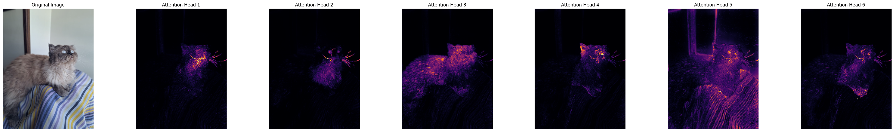
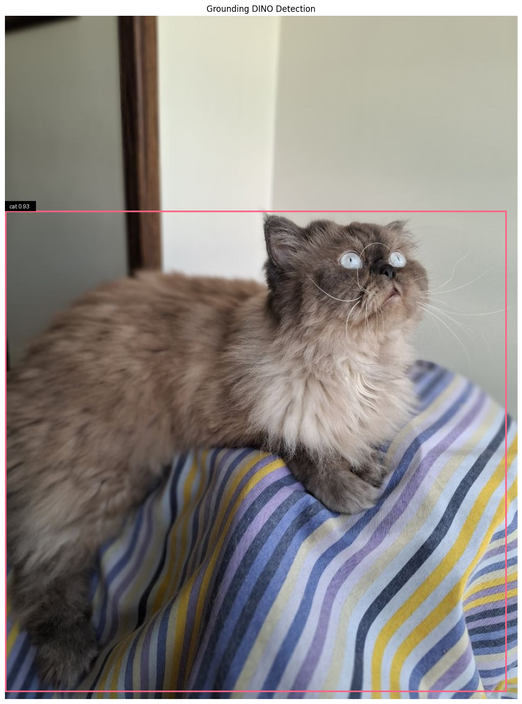
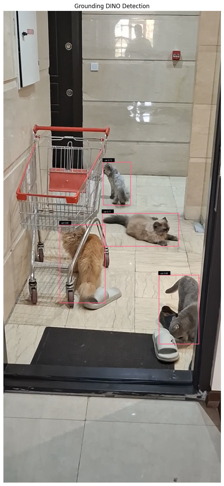
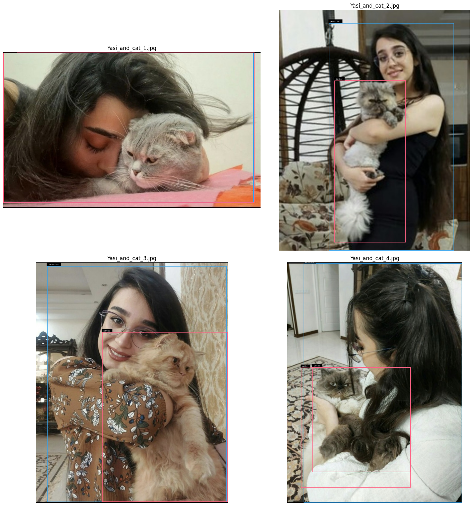
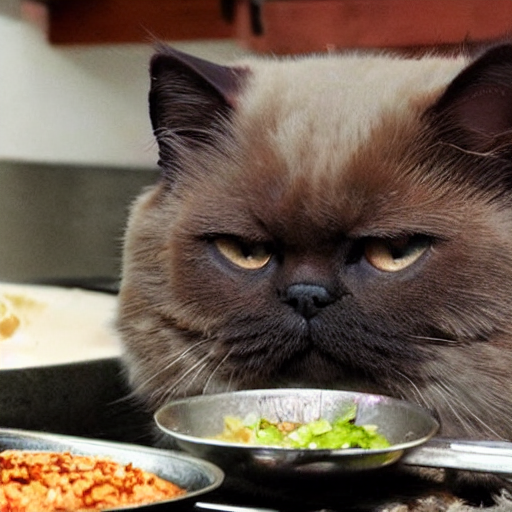
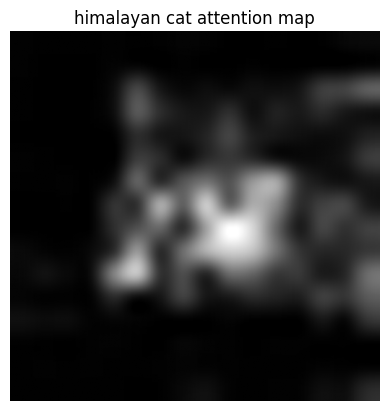
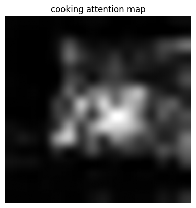
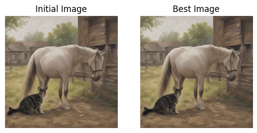

# Chapter 5: DINO and Stable Diffusion Models

In this chapter, we explore two important areas of modern deep learning: **self-supervised vision models** and **prompt-based generative models**. In particular, we work with **DINO (Self-Distillation with No Labels)**, **Grounding DINO**, and **Stable Diffusion**.

This chapter provides both a theoretical foundation and a practical, ready-to-use introduction to these models.

Why use the term *ready-to-use*? Training large-scale models such as Stable Diffusion from scratch requires enormous datasets, computational resources, and training time. Therefore, instead of training these models entirely from scratch, the practical sections focus on understanding their architectures, using pretrained models, analyzing their behavior, and experimenting with their outputs.

Because some of these models are computationally expensive, I used cloud-based GPU resources during the practical parts of this chapter, including:

* **NVIDIA Tesla T4 GPUs on Kaggle**

These resources made it possible to run experiments with the models more efficiently.

Throughout this chapter, I also saved the generated results and visualizations from the experiments. The following sections include the implementations, experiments, and outputs for each model.

> **Note**
>
> This chapter is divided into two sections:
>
> * Theoretical
> * Practical

---

# ✒️ Theoretical Part

The theoretical section of this chapter covers several important concepts behind modern self-supervised vision and prompt-based modeling, including:

* Details of the **CLIP architecture**
* Self-supervised learning with **BYOL**

---

# 👨‍💻 Practical Part

The practical section consists of two main parts, which are presented below.

## 1. DINO

In this part, we develop an understanding of how DINO works, how its architecture is designed, and how attention can reveal which regions of an image the model considers important.

We then move to **Grounding DINO**, where text prompts are used to detect and localize objects.

To make the experiments more interesting and realistic, I used several personal photos of my cats and family members. These were ordinary smartphone photographs rather than professionally prepared images, allowing me to observe how the models perform on real-world inputs.

### Part 1: Visualizing Attention Maps in DINO

In this section, we explore **DINO (Self-Distillation with No Labels)**, a self-supervised learning framework that can learn meaningful visual representations without requiring manually labeled data.

When DINO is used with Vision Transformers (ViTs), the learned attention maps can reveal which image regions the model considers important.

Our goal is to visualize these attention maps and gain insight into how the model interprets an image.

For this experiment, I used a picture of my Himalayan cat, Alpha:

  
   
  <em>Figure 1: Six attention maps generated from Alpha's image.</em>

As shown above, different attention heads focus on different regions and characteristics of Alpha. Some heads emphasize areas such as the face and whiskers, while others focus more strongly on the body or surrounding boundaries.

This is one of the interesting properties of Transformer-based vision models: different attention heads can learn to capture different visual relationships within the same image.

---

### Part 2: Grounding DINO for Text-Guided Object Detection

In the previous section, we explored how DINO-based Vision Transformers can attend to different regions of an image.

In this section, we move to **Grounding DINO**, an open-set object detection model that combines image and text representations. It can detect and localize objects based on natural-language prompts such as:

* `"cat"`
* `"person"`
* `"red backpack"`
* `"person holding a cat"`

Unlike conventional object detectors that are usually restricted to a predefined set of classes, Grounding DINO can use text prompts to specify the objects we want to detect.

I tested the model using several personal images, including individual pictures of my cats, a photo containing all four cats, and images of my sister holding them.

  
   
  <em>Figure 2: Alpha detected and localized using Grounding DINO.</em>

As shown above, the model assigns a high confidence score to Alpha and successfully identifies the cat's spatial boundaries.

  
   
  <em>Figure 3: The whole gang detected 😅.</em>

The model successfully detects all four cats and draws appropriate bounding boxes around them.

  
   
  <em>Figure 4: Yasamin, my sister, holding and hugging our cats.</em>

This example introduces a more challenging situation.

For three of the cats, the model produces accurate bounding boxes. However, for our cat **Catt**, located in the upper-left part of the image, the boundary between the cat and my sister is highly intertwined because of the pose, camera angle, and physical overlap.

As a result, the model struggles to clearly separate their spatial boundaries and produces a larger combined bounding region.

This demonstrates an important challenge in object detection: **heavy occlusion and overlapping objects can make precise localization considerably more difficult**.

---

## 2. Stable Diffusion

In this section, we explore the **Stable Diffusion** model through three practical stages.

### 2.1 Introduction to Stable Diffusion and Text-to-Image Generation

We begin by understanding how **Stable Diffusion** works and how it can be used for text-to-image generation.

Stable Diffusion is a **latent diffusion model** conditioned on textual prompts. Instead of performing the diffusion process directly in pixel space, it operates in a lower-dimensional latent representation, making the generation process substantially more computationally efficient.

A text prompt is encoded and used to condition the denoising process, allowing the model to generate an image that corresponds to the provided description.

In this section, we examine the generation pipeline step by step and use text prompts to guide image synthesis.

---

### 2.2 Exploring Attention Maps for Better Prompt Alignment

In this part, we explore **attention maps** to better understand how different words in a prompt influence different regions of the generated image.

Cross-attention mechanisms allow the image-generation process to associate textual tokens with spatial regions in the latent representation.

By visualizing these attention maps, we can gain insight into where the model focuses when processing individual words from the prompt.

If you have not noticed yet how much I love my cats 😅, I first generated an image using a prompt involving a **Himalayan cat** and **cooking**.

The generated image is shown below:

  
   
  <em>Figure 5: Original Stable Diffusion-generated image based on the cat-and-cooking prompt.</em>

We first examine the complete generated image.

  
   
  <em>Figure 6: Attention map corresponding to the word <strong>cat</strong>.</em>

The attention map above shows which spatial regions are most strongly associated with the word **cat** during generation.

  
   
  <em>Figure 7: Attention map corresponding to the word <strong>cooking</strong>.</em>

We can then compare this with the attention associated with the word **cooking**.

As shown in the visualizations, the regions emphasized by the model vary depending on the token being analyzed. This provides an intuitive view of how the text prompt influences different spatial components of the generated image.

---

### 2.3 Noise Optimization (Bonus)

Moving beyond attention-map visualization, this section explores **noise optimization**.

In diffusion models, image generation begins from an initial noise representation. Instead of treating this initial noise as completely fixed, it can be optimized with respect to an external objective.

For example, a **CLIP-based similarity objective** can be used to encourage the generated image to align more closely with the desired text prompt.

By optimizing the initial latent noise before or during the generation process, it is possible to guide the resulting image toward outputs with better semantic alignment or other desired properties.

The result of this experiment is shown below:

  
   
  <em>Figure 8: Stable Diffusion generation using a noise-optimization technique.</em>

This experiment demonstrates that the initial latent representation is not merely random input; it can also be treated as an optimizable variable that influences the final generated image.

---
